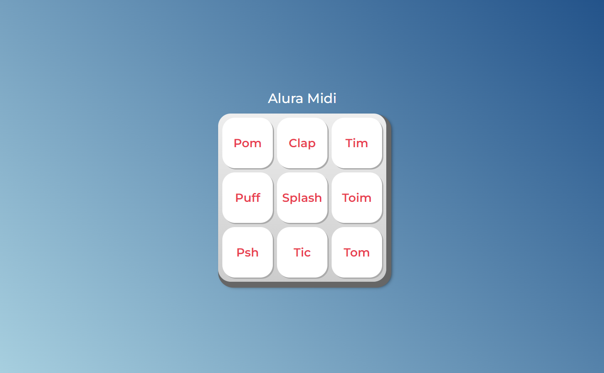

# Alura Midi | Praticando CSS: Grid e Flexbox

Repositório com projeto Alura Midi desenvolvido durante o curso JavaScript para Web: Crie páginas dinâmicas da [Alura](https://www.alura.com.br/) Escola Online de Tecnologia.

## 📁 Detalhes do projeto

	

 

O Alura Midi é um teclado digital com 9 botões. Ao clicar em cada botão um som será reproduzido.

O initial commit é referente aos arquivos HTML e CSS disponibilizados pela instrutora do curso.

O desafio do projeto foi desenvolver a interatividade dos botões através do mouse e teclado e reproduzir os sons de cada botão.

## 📚 Temas abordados

* Eventos `onclick` `onkeydown` `onkeyup`;
* Manipular elementos e explorar propriedades e funcionalidades nativas como `play()`;
* Criar listas de elementos com `querySelectorAll()` e acessa-las com seus respectivos índices;
* Trabalhar com loops através de estruturas `while` e `for`;
* Criar textos dinâmicos com template string;
* Criar condições para garantir maior segurança ao código, através da estrutura condicional `if… else`;
* Manipular classes de CSS via JS.

## 🖥️ Acesso ao projeto

[Clique aqui](https://aluramidi-mu.vercel.app/) para acessar o Alura Midi no seu navegador.

Após acessar o projeto basta navegar com o mouse clicando nos botões para reproduzir os sons ou através do teclado com as teclas Tab, enter e espaço.

## 👩‍💻 Tecnologias utilizadas

	
	
	

Desenvolvido com 💙 por [Juliana Lucca](https://www.linkedin.com/in/julianalucca/)